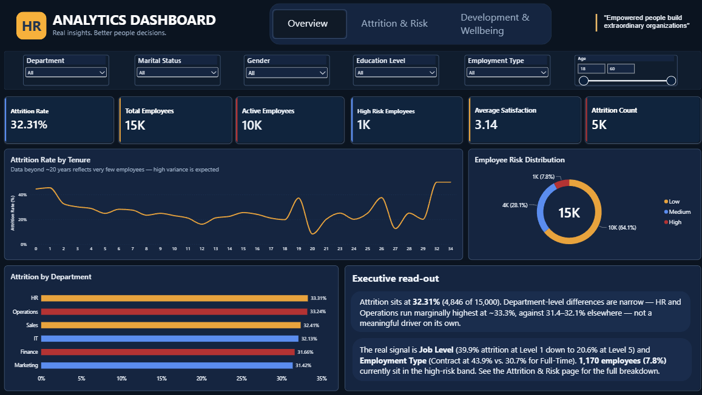
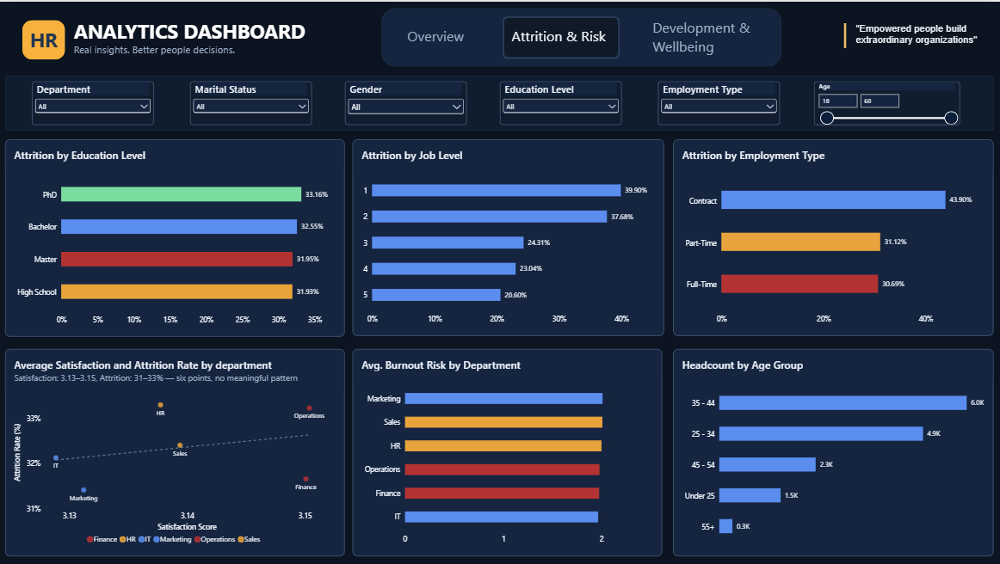
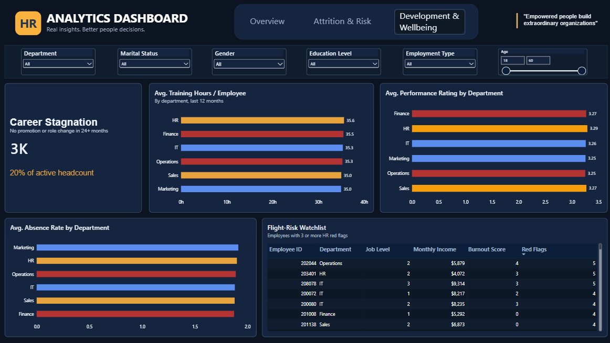

# Workforce Insights Dashboard

Infosys Springboard Virtual Internship Program 7.0
- Batch: Batch-2
- Team: Team 1

**AI-powered HR analytics platform** that combines a PostgreSQL-backed analytics API, machine learning models for attrition and skill-gap prediction, a rule-based recommendation engine, and a Retrieval-Augmented Generation (RAG) chat assistant grounded in internal HR policy documents — all surfaced through an interactive web dashboard.

> Real insights. Better people decisions.

[](https://www.python.org/)
[](https://fastapi.tiangolo.com/)
[](https://supabase.com/)
[](LICENSE)


**Live demo:**
- Frontend: [creation-of-workforce-insights-dashboard-q5io.onrender.com](https://creation-of-workforce-insights-dashboard-q5io.onrender.com/)
- Backend API docs : [creation-of-workforce-insights-dashboard-4cmu.onrender.com/docs](https://creation-of-workforce-insights-dashboard-4cmu.onrender.com/docs)

---

## What It Looks Like

Alongside the live web dashboard above, the project also ships a companion **Power BI report** (`Power Bi Dashboard/projectdashboardfinal.pbix`) for self-service exploration of the same workforce data:





It covers headline KPIs (attrition count, active employees, high-risk employees, average satisfaction), attrition rate by department/education/job level/employment type, burnout risk by department, satisfaction-vs-attrition, employee risk distribution, training hours, absence rate, and a searchable employee directory — filterable by department, marital status, gender, education level, employment type, and age.

---

## Features

- **Executive dashboard** — headcount, attrition rate, and department-level breakdowns at a glance
- **Employee directory** — browse and drill into individual employee profiles, roles, and risk indicators
- **Attrition prediction** — Random Forest model estimates the probability that an employee will leave (75.53% accuracy)
- **Skill-gap prediction** — LightGBM model flags employees with a projected skill gap (79.80% accuracy)
- **At-risk employee list** — surfaces employees ranked by HR red-flag count and burnout risk score
- **Recommendations engine** — rule-based logic generates suggested retention/training actions per employee
- **HR policy chat assistant** — a hybrid-retrieval RAG pipeline (TF-IDF/FAISS + BM25 search, reciprocal rank fusion, TF-IDF cosine reranking) answers natural-language questions against an internal HR knowledge base, via the Groq API
- **Power BI report** — a second, self-service analytics view of the same dataset

---

## Architecture

```
┌──────────────────────────┐         ┌─────────────────────────┐        ┌────────────────────────┐
│   Frontend               │  HTTP   │   Backend API           │        │   PostgreSQL           │
│   (FastAPI + Jinja2)     │ ─────►  │   (FastAPI)             │ ─────► │   employees /          │
│   Dashboard, Employees,  │         │   /analytics            │        │   employee_metrics /   │
│   Attrition, Skill Gap,  │         │   /predictions          │        │   predictions          │
│   Recommendations, Chat  │         │   /chat                 │        └────────────────────────┘
└──────────────────────────┘         │                         │
                                     │  ┌───────────────────┐  │        ┌────────────────────────┐
                                     │  │ ML Models         │  │        │ RAG Pipeline           │
                                     │  │ (attrition_model, │  │        │ TF-IDF/FAISS + BM25 →  │
                                     │  │  skill_gap_model) │◄ ┼────────│ RRF → TF-IDF rerank →  │
                                     │  └───────────────────┘  │        │ context expander →     │
                                     │                         │        │ Groq LLM               │
                                     └─────────────────────────┘        └────────────────────────┘
```

The **Frontend** service proxies certain calls (`/api/...`) to the **Backend** service via the `BACKEND_URL` environment variable, so both can be deployed independently — as they are on Render.

---

## Tech Stack

| Layer | Technology |
|---|---|
| Frontend | FastAPI, Jinja2, HTML/CSS/JS (static assets), Chart.js |
| Backend API | FastAPI, SQLAlchemy, pg8000 |
| Database | PostgreSQL 15 (hosted on Supabase, Session Pooler, SSL) |
| ML / Modeling | scikit-learn (Random Forest), LightGBM, pandas, numpy, joblib |
| RAG / Retrieval | LangChain (chunking), scikit-learn TF-IDF + FAISS, rank_bm25, TF-IDF cosine reranker |
| LLM Provider | Groq API |
| Self-Service BI | Power BI |
| Deployment | Render (frontend + backend as separate web services) |

---

## Project Structure

```
├── Frontend/                      # FastAPI frontend service (dashboard UI)
│   ├── app.py                     # Routes, templating, chart data prep, backend proxy
│   ├── templates/                 # attrition, dashboard, employee_details, employees,
│   │                               #   predictions, recommendations, skill_gap
│   └── static/                    # charts.js, dashboard.js, employees.js, style.css
│
├── backend/                       # FastAPI backend API service
│   ├── main.py                    # App entrypoint, router registration
│   ├── database.py                # SQLAlchemy engine/session setup (pg8000 driver)
│   ├── local_powershell_script.ps1 # Loads .env and starts the backend (Windows)
│   └── routers/
│       ├── analytics.py           # /analytics/summary, /by-department, /at-risk
│       ├── predictions.py         # /predictions/attrition, /predictions/skill-gap
│       └── chat.py                # /chat — RAG-powered Q&A
│
├── Machine Learning/
│   ├── train_attrition.py         # Trains the Random Forest attrition classifier
│   ├── train_skill_gap.py         # Trains the LightGBM skill-gap model
│   ├── models/                    # attrition_model.pkl, skill_gap_model.pkl (Git LFS)
│   └── Featured Engineering.csv   # Engineered feature dataset (63 columns)
│
├── RAG/
│   ├── main.py                    # End-to-end RAG pipeline orchestration
│   ├── load_documents.py          # Loads source documents for chunking/embedding
│   ├── chunk_documents.py         # Markdown header-aware document chunking
│   ├── create_vectorstore.py      # Builds the TF-IDF vectorizer + FAISS index
│   ├── hybrid_retrieve.py         # TF-IDF/FAISS + BM25 hybrid retrieval, RRF fusion
│   ├── reranker.py                # TF-IDF cosine-similarity reranking
│   ├── context_expander.py        # Expands retrieved chunks with neighbouring context
│   ├── llm.py                     # Groq API call wrapper
│   ├── test_embeddings.py         # Embedding/retrieval sanity tests
│   ├── knowledge_base/
│   │   └── documents/             # career_growth.md, employee_retention.md,
│   │                               #   employee_skill_development.md,
│   │                               #   performance_management.md, workforce_policy.md
│   └── vectorstore/                # Persisted FAISS index + chroma.sqlite3
│
├── Power BI Dashboard/
│   └── projectdashboardfinal.pbix # Power BI report
│
├── dashboard/                      # Exported dashboard screenshots
│   ├── Dashboard_Overview.png
│   ├── Attrition_&_Risk.png
│   └── Development_&_Wellbeing.png
│
├── data/
│   ├── raw/                        # employee_attrition_dataset.csv
│   └── processed/                  # employee_attrition_cleaned_dataset.csv
│
├── database/
│   ├── schema.sql                  # Postgres table definitions
│   └── load_to_postgres.py         # Loads processed data into Postgres (psycopg2, batched)
│
├── recommendation/
│   └── recommendation_engine.py    # Generates per-employee recommendations from model outputs
│
├── outputs/                        # attrition_predictions.csv, skill_gap_predictions.csv,
│                                    #   recommendations.json
│
├── notebook/
│   └── EDA1.ipynb                  # Exploratory data analysis
│
├── testing_points/
│   ├── test_all_endpoints.py       # Backend endpoint smoke tests
│   └── test_frontend_pages.py      # Frontend page smoke tests
│
├── .gitattributes                  # Git LFS tracking rules
├── .gitignore
└── requirements.txt
```

---

## API Reference

Full interactive documentation is available at `/docs` on the backend service (Swagger UI) — see the [live docs](https://creation-of-workforce-insights-dashboard-4cmu.onrender.com/docs).

### Analytics
| Method | Endpoint | Description |
|---|---|---|
| GET | `/analytics/summary` | Total employees, attrition count, and attrition rate |
| GET | `/analytics/by-department` | Headcount and attrition rate grouped by department |
| GET | `/analytics/at-risk?limit=20` | Employees ranked by HR red-flag count and burnout risk score |

### Predictions
| Method | Endpoint | Description |
|---|---|---|
| POST | `/predictions/attrition` | Returns an attrition probability + predicted label |
| POST | `/predictions/skill-gap` | Returns a skill-gap prediction |

Example request body for both:
```json
{
  "age": 34,
  "monthly_income": 5200,
  "years_at_company": 4,
  "overall_satisfaction_index": 0.62,
  "burnout_risk_score": 0.41,
  "absence_rate_per_year": 0.05,
  "is_new_hire": 0,
  "overtime_and_low_satisfaction_flag": 0
}
```

### Chat (RAG assistant)
| Method | Endpoint | Description |
|---|---|---|
| POST | `/chat` | Ask a natural-language HR/workforce policy question |

```json
{ "message": "What is the policy for remote work?" }
```

### Health
| Method | Endpoint | Description |
|---|---|---|
| GET | `/` | Service status message |
| GET | `/health` | Basic health check |

---

## Machine Learning Results

| Model | Algorithm | Accuracy | Output |
|---|---|---|---|
| Attrition Prediction | Random Forest (200 trees) | 75.53% | `attrition_model.pkl` |
| Skill Gap Prediction | LightGBM (200 estimators) | 79.80% | `skill_gap_model.pkl` |

Top attrition drivers: job satisfaction, overall satisfaction index, overtime, burnout risk score, commute time.

---

## Getting Started (Local Development)

### Prerequisites
- Python 3.10+
- A PostgreSQL instance (e.g. a free [Supabase](https://supabase.com) project)
- A free [Groq](https://console.groq.com) API key (for the chat assistant)

### 1. Clone and install dependencies
```bash
git clone https://github.com/srishtimishra30/Creation-of-Workforce-Insights-Dashboard-for-Employee-Skill-and-Analytics.git
cd Creation-of-Workforce-Insights-Dashboard-for-Employee-Skill-and-Analytics
pip install -r requirements.txt
```

> The trained models under `Machine Learning/models/` are tracked with **Git LFS** — run `git lfs pull` if the API responds with a "model not found" error.

### 2. Configure environment variables
Create a `.env` file in the project root:
```env
# PostgreSQL (Supabase)
DB_USER=your_supabase_user
DB_PASSWORD=your_supabase_password
DB_HOST=your_supabase_host
DB_PORT=5432
DB_NAME=postgres
DB_SSL=true

# RAG assistant
GROQ_API_KEY=your_groq_api_key

# Only needed when running frontend and backend as separate processes
BACKEND_URL=http://127.0.0.1:8000
```

### 3. Set up the database
```bash
psql -U <user> -d <database> -f database/schema.sql
python database/load_to_postgres.py
```

### 4. Train the ML models (optional — pretrained artifacts are included in `Machine Learning/models/`)
```bash
python "Machine Learning/train_attrition.py"
python "Machine Learning/train_skill_gap.py"
python recommendation/recommendation_engine.py
```

### 5. Build the RAG vector store (optional — a prebuilt index is included in `RAG/vectorstore/`)
```bash
python RAG/create_vectorstore.py
```

### 6. Run the backend API
```bash
# Windows
./start_backend.ps1

# macOS/Linux
uvicorn backend.main:app --reload --port 8000
```
API will be available at `http://127.0.0.1:8000`, docs at `http://127.0.0.1:8000/docs`.

### 7. Run the frontend
```bash
uvicorn Frontend.app:app --reload --port 5000
```
Dashboard will be available at `http://127.0.0.1:5000`. Core dashboard pages work standalone; the AI chat and the `/api/analytics/*` proxy routes additionally require the backend API and Postgres to be running.

---

## Testing

```bash
python test_all_endpoints.py      # Backend endpoint smoke tests
python test_frontend_pages.py     # Frontend page smoke tests
```

---

## Deployment

Both services are deployed independently on [Render](https://render.com):

- **Backend** — a FastAPI web service exposing the `/analytics`, `/predictions`, and `/chat` routes, plus interactive docs at `/docs`.
- **Frontend** — a separate FastAPI + Jinja2 web service that renders the dashboard UI and proxies API calls to the backend via the `BACKEND_URL` environment variable.

To deploy your own instance:
1. Deploy `backend/` as a web service with start command `uvicorn backend.main:app --host 0.0.0.0 --port $PORT`, and set `DB_USER`, `DB_PASSWORD`, `DB_HOST`, `DB_PORT`, `DB_NAME`, `DB_SSL`, and `GROQ_API_KEY` as environment variables.
2. Deploy `Frontend/` as a separate web service with start command `uvicorn Frontend.app:app --host 0.0.0.0 --port $PORT`, and set `BACKEND_URL` to the backend's deployed URL.

---

## Team Contributors

|## Contributors

| Name | GitHub Username |
|------|------------------|
| Harshitha Nagilla | (https://github.com/harshithanagilla25-netizen/Creation-of-Workforce-Insights-Dashboard-for-Employee-Skill-and-Analytics) |
| Srishti Mishra | (https://github.com/srishtimishra30/Creation-of-Workforce-Insights-Dashboard-for-Employee-Skill-and-Analytics) |
| Santosh Kumar Kolagani | (https://github.com/Santosh8956/Creation-of-Workforce-Insights-Dashboard-for-Employee-Skill-and-Analytics) |
| Thivya Priya G | (https://github.com/Thivya48/Creation-of-Workforce-Insights-Dashboard-for-Employee-Skill-and-Analytics) |
| Anil Poojar | (https://github.com/anilpoojar45-hash/Creation-of-Workforce-Insights-Dashboard-for-Employee-Skill-and-Analytics) |
| Gowtham | (https://github.com/gowtham0759/Creation-of-Workforce-Insights-Dashboard-for-Employee-Skill-and-Analytics) |
| Surendhar T | (https://github.com/surendharsurendhar888-collab/Creation-of-Workforce-Insights-Dashboard-for-Employee-Skill-and-Analytics) |

---

## License

Distributed under the [MIT License](LICENSE).
